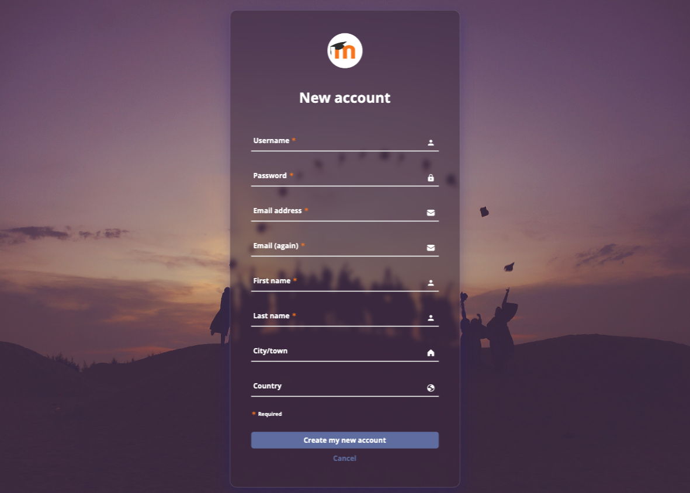

# Moodle forms - commercial project 

Three Moodle forms utilize the latest version 5.3 of Bootstrap and feature special animations implemented using jQuery or CSS. The forms were developed based on my own designs crafted in Figma.

### Overview

These three Moodle forms are designed to facilitate account creation for full access to Moodle. They integrate HTML, CSS, Bootstrap, JavaScript, and jQuery to deliver user-friendly forms with validation and a pleasant user experience.

### Link

- Live preview Form3: [https://65ff28c43840ca3de0d9af87--moodle-forms-basiakedz.netlify.app/form3/](https://65ff28c43840ca3de0d9af87--moodle-forms-basiakedz.netlify.app/form3/)

- Live preview Form2: [https://65ff28c43840ca3de0d9af87--moodle-forms-basiakedz.netlify.app/form2/](https://65ff28c43840ca3de0d9af87--moodle-forms-basiakedz.netlify.app/form2/)

- Live preview Form1: [https://65ff28c43840ca3de0d9af87--moodle-forms-basiakedz.netlify.app/form1/](https://65ff28c43840ca3de0d9af87--moodle-forms-basiakedz.netlify.app/form1/)

### Built with

- **Semantic HTML**: Structuring the app's user interface.
- **CSS**: Styling the app's appearance and creating animation.
- **Bootstrap v5.3**: Enhancing the app's appearance.
- **Vanilla JavaScript**: Handling form validation.
- **jQuery**: Implementing dynamic animations.

### How to Use

1. Clone this repository to your local machine.
2. Open the `index.html` file in a web browser.
3. Fill out the form with your username, password, email address, first name, last name, city, and country.
4. Click the "Create my new account" button to submit the form.

### Form3

### Form2

### Form1

